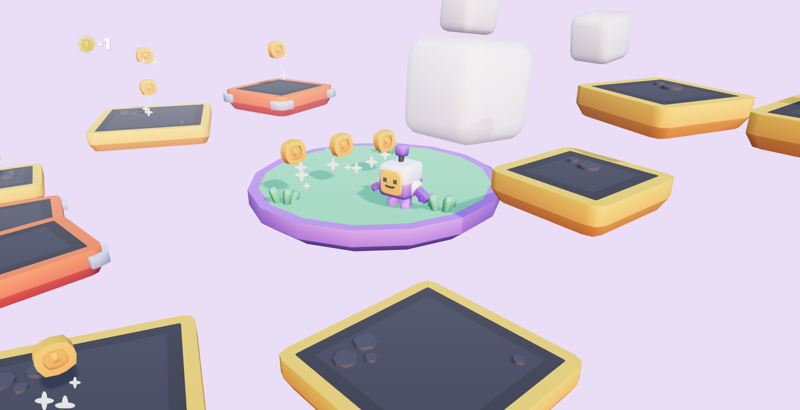

# React Three Fiber 3D Platformer Starter Kit

This repository is a modified version of the [3D Platformer Starter Kit](https://github.com/KenneyNL/Starter-Kit-3D-Platformer) originally created by Kenney, adapted to showcase the usage of [React Three Fiber](https://github.com/pmndrs/react-three-fiber) for developing 3D web games.

## Screenshot

<p align="center"></p>

## Goal

The primary aim of this project is to provide an example React Three Fiber project that other developers can use to learn from and build their own 3D platformer games.

## Getting Started

To get started with this project, follow these steps:

1. Clone this repository
2. Install dependencies:
   ```bash
   npm install
   ```
3. Start the development server:
   ```bash
   npm run dev
   ```
4. Open your browser and navigate to `http://localhost:5173`

## Credits

- Original 3D Platformer Starter Kit by Kenney - [KenneyNL/Starter-Kit-3D-Platformer](https://github.com/KenneyNL/Starter-Kit-3D-Platformer)
- React Three Fiber by pmndrs - [pmndrs/react-three-fiber](https://github.com/pmndrs/react-three-fiber)

> ### License
>
> MIT License
>
> Copyright (c) 2023 Kenney
>
> Permission is hereby granted, free of charge, to any person obtaining a copy of this software and associated documentation files (the "Software"), to deal in the Software without restriction, including without limitation the rights to use, copy, modify, merge, publish, distribute, sublicense, and/or sell copies of the Software, and to permit persons to whom the Software is furnished to do so, subject to the following conditions:
>
> The above copyright notice and this permission notice shall be included in all copies or substantial portions of the Software.
>
> THE SOFTWARE IS PROVIDED "AS IS", WITHOUT WARRANTY OF ANY KIND, EXPRESS OR IMPLIED, INCLUDING BUT NOT LIMITED TO THE WARRANTIES OF MERCHANTABILITY, FITNESS FOR A PARTICULAR PURPOSE AND NONINFRINGEMENT. IN NO EVENT SHALL THE AUTHORS OR COPYRIGHT HOLDERS BE LIABLE FOR ANY CLAIM, DAMAGES OR OTHER LIABILITY, WHETHER IN AN ACTION OF CONTRACT, TORT OR OTHERWISE, ARISING FROM, OUT OF OR IN CONNECTION WITH THE SOFTWARE OR THE USE OR OTHER DEALINGS IN THE SOFTWARE.
>
> Assets included in this package (2D sprites, 3D models and sound effects) are [CC0 licensed](https://creativecommons.org/publicdomain/zero/1.0/)
